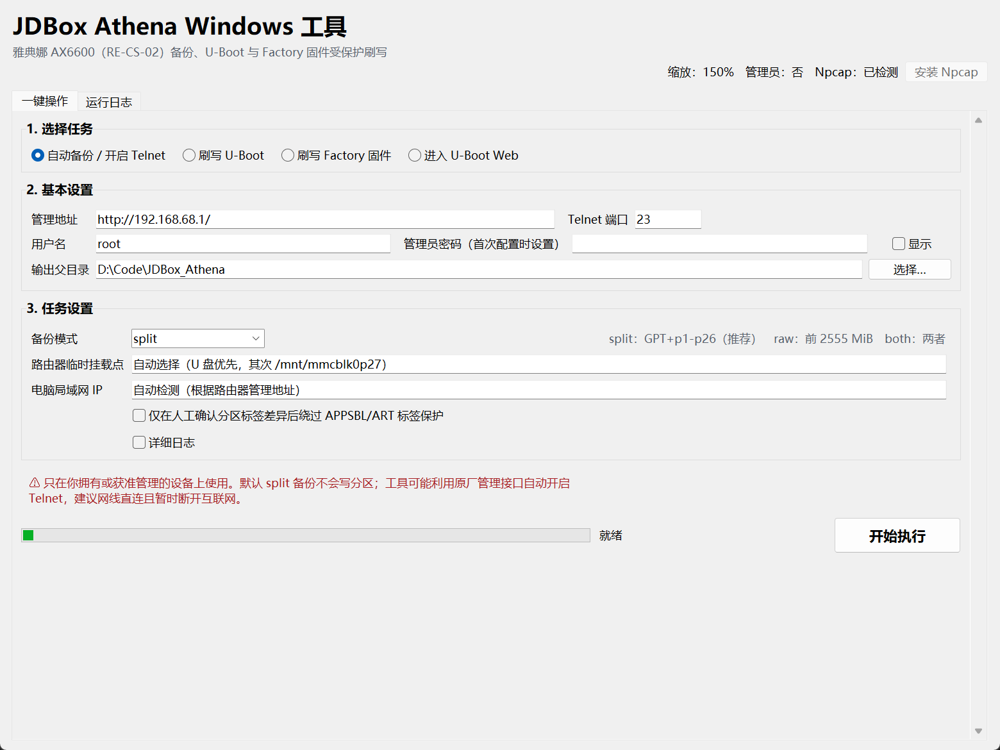
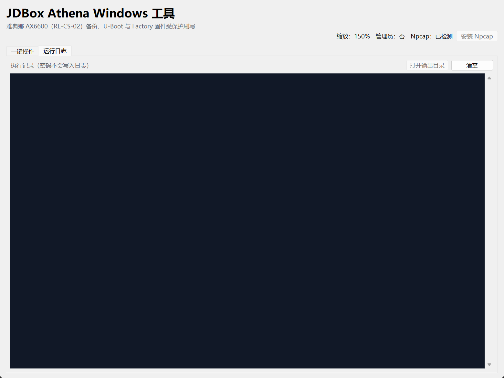
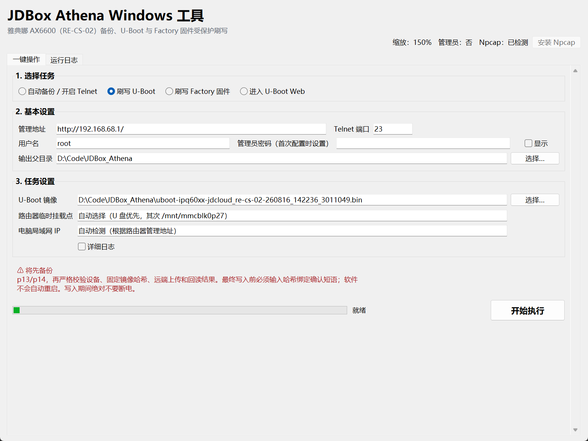
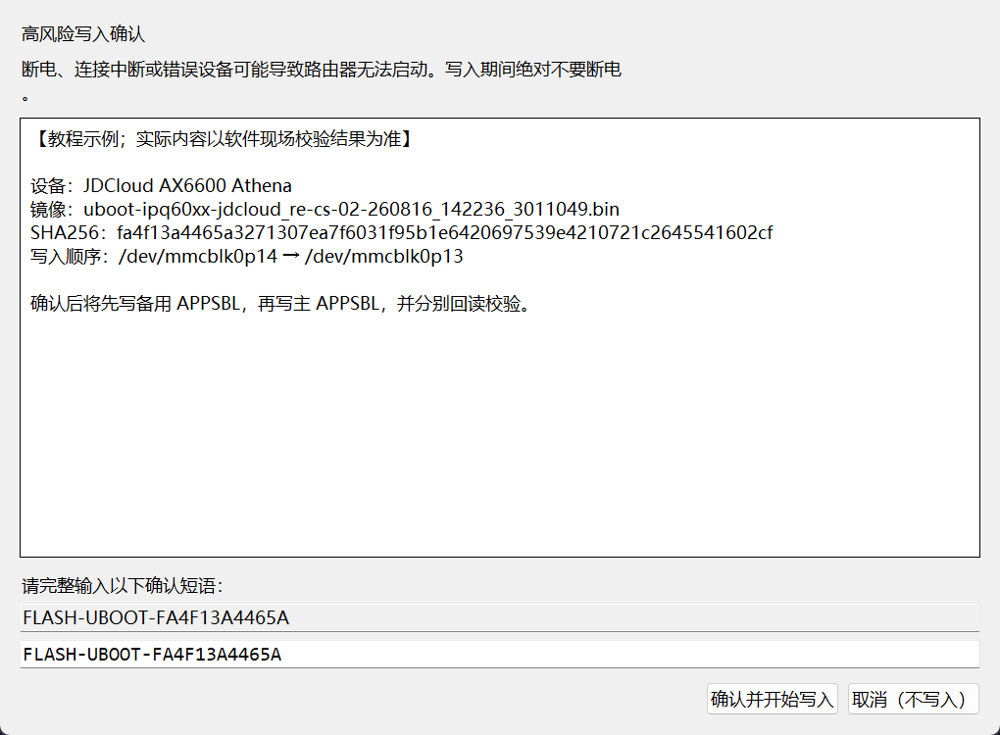
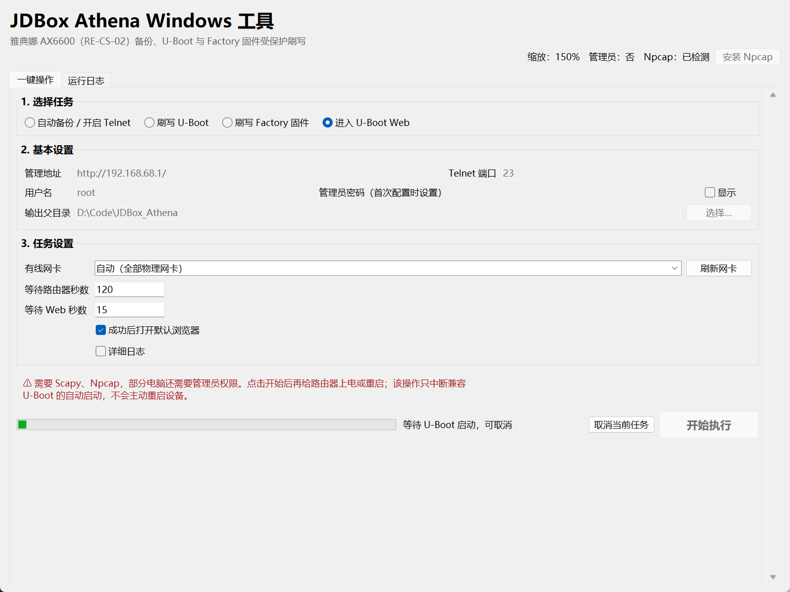
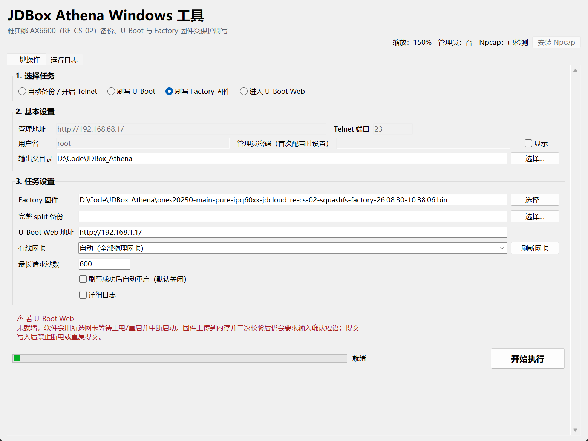
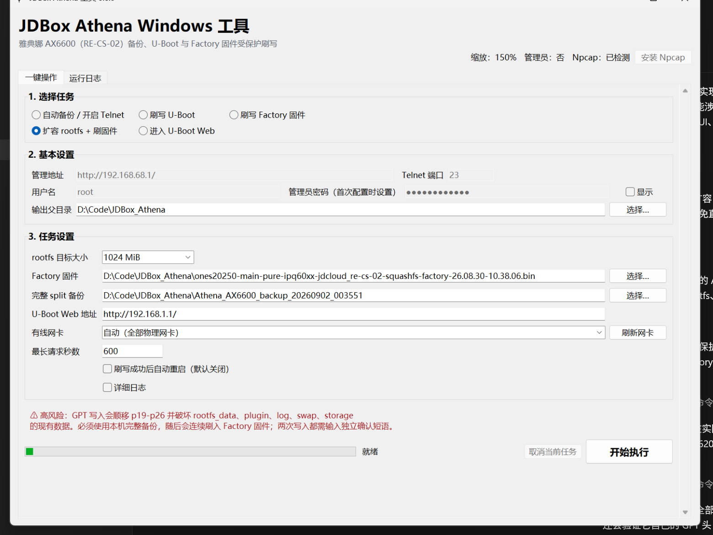

# JDBox Athena Windows 可视化操作教程

适用版本：v0.6.0
适用设备：京东云无线宝·雅典娜 AX6600（RE-CS-02）

> 本工具只应在你拥有或已明确获准管理的设备上使用。刷写 U-Boot 或系统固件存在变砖风险；请使用稳定电源和有线网络，并在任何写入开始后保持供电。

## 一、推荐操作顺序

第一次使用时，推荐严格按下列顺序操作：

1. 用网线把电脑连接到路由器 LAN 口，保持稳定供电。
2. 执行“自动备份 / 开启 Telnet”，选择 `split` 完整分区备份。
3. 核对备份报告并把备份复制到另一个安全位置。
4. 如有需要，执行“刷写 U-Boot”，完成回读校验后再重启。
5. 使用“进入 U-Boot Web”让路由器停在 U-Boot 管理页面。
6. 如需更多 overlay 空间，执行“扩容 rootfs + 刷固件”；否则执行“刷写 Factory 固件”。
7. 核对所有写入报告后再启动新系统。

如果你只想备份，不需要执行后面的刷写步骤。

## 二、首次启动与界面状态

1. 解压整个 `JDBox_Athena_v0.6.0` 文件夹，不要只复制 EXE。
2. 双击 `JDBox_Athena_v0.6.0.exe`。
3. 查看窗口右上角状态：
   - “缩放”会跟随 Windows 125%、150%、200% 等高分辨率缩放设置。
   - “Npcap”用于“进入 U-Boot Web”。如果显示未安装，点击界面中的“安装 Npcap”，并在 Windows 用户账户控制窗口中确认。
   - 普通备份通常不要求管理员权限；网卡底层通信失败时，可右键 EXE 选择“以管理员身份运行”。
4. Windows SmartScreen 如果提示未知发布者，请只在你确认安装包来源和哈希可信时选择继续运行。

界面采用 Per-Monitor V2 高 DPI 模式。把窗口移动到不同缩放比例的显示器时，字体和控件会自动调整；任务页也可滚动，小屏幕上仍可访问底部按钮。

## 三、常用字段和默认值

| 字段 | 默认值 | 建议 |
| --- | --- | --- |
| 路由器管理地址 | `http://192.168.68.1/` | 京东云官方默认管理地址；改过网段时填写实际地址 |
| Telnet 端口 | `23` | 一般保持默认 |
| 用户名 | `root` | 京东云系统的 Shell/API 默认用户名 |
| 管理员 / Telnet 密码 | 空 | 填写路由器首次配置时设置的管理员密码；官方没有统一出厂密码，且不一定与 Wi-Fi 密码相同 |
| 输出父目录 | EXE 所在目录 | 每次运行会新建带时间戳的子目录，不覆盖旧结果 |
| 路由器临时挂载点 | 自动选择 | 优先可用 U 盘，其次 `/mnt/mmcblk0p27`；有特殊需求时才手动覆盖 |
| 电脑局域网 IP | 自动检测 | 根据管理地址和系统路由自动选择；多网卡或 raw 连接失败时再手动填写 |
| rootfs 目标大小 | `1024 MiB` | 仅扩容入口使用；可固定选择 512、1024、2048、8192 MiB |

## 四、自动备份 / 开启 Telnet（必须先做）

1. 选择顶部任务“自动备份 / 开启 Telnet”。
2. 确认管理地址、端口和用户名；在密码框中输入路由器管理员密码。
3. “备份模式”首次使用选择 `split`（推荐）。
4. “路由器临时挂载点”保持“自动选择（U 盘优先，其次 /mnt/mmcblk0p27）”。
5. “电脑局域网 IP”保持“自动检测（根据路由器管理地址）”。该字段主要用于 `raw` 流式备份。
6. 建议勾选“显示详细日志”。不要随意勾选“强制继续”；只有人工核对设备型号和分区布局后才可使用，而且它不能绕过刷写校验。
7. 点击“开始执行”，等待日志显示完成。

### 备份模式怎么选

| 模式 | 内容 | 适用场景 |
| --- | --- | --- |
| `split` | 主 GPT、备用 GPT、p1-p26 单独文件 | 首次备份和后续刷写前检查，推荐 |
| `raw` | `/dev/mmcblk0` 前 2555 MiB 的完整镜像 | 需要整段镜像留档；耗时和空间占用较大 |
| `both` | 同时执行 split 和 raw | 希望保留两种备份、且磁盘空间充足 |

`split` 临时文件会先在路由器上计算 MD5/SHA256，下载后再在电脑上逐项比对；`raw` 数据直接流向电脑，不会把 2555 MiB 镜像暂存在路由器内置分区。

### 如何判断备份成功

点击右下角“打开输出目录”，进入本次 `Athena_AX6600_backup_日期时间` 文件夹，并确认：

- `backup-info.json` 中的 `status` 为 `complete`；
- 存在 `gpt-primary.bin`、`gpt-backup.bin` 和 p1-p26 分区文件；
- 存在 `manifest.json`、`MD5SUMS`、`SHA256SUMS`；
- 日志没有未处理的校验失败。

把整个备份文件夹复制到另一块磁盘或可信存储中。状态为 `incomplete` 的目录不能作为刷 Factory 固件前的完整备份。

## 五、运行日志怎么看

- 日志按时间显示当前阶段、目标设备、哈希校验、传输和报告位置。
- 勾选“显示详细日志”可获得排障信息；密码不会写入日志或报告。
- “打开输出目录”用于快速查看本次备份或刷写报告；“清空日志”只清除界面内容，不删除磁盘文件。
- 操作看似停住时，先看日志是否仍在计算哈希或传输大文件，不要直接断电或强制关闭。

## 六、刷写 U-Boot

### 开始前必须满足

- 已有一份 `status = complete` 的完整 split 备份，并已另行保存。
- 设备确认是京东云雅典娜 AX6600（RE-CS-02）。
- 使用稳定电源和有线 LAN；写入期间绝不关机、拔线或关闭工具。
- 只使用工具内置并锁定哈希的 U-Boot 镜像。

1. 选择“刷写 U-Boot”。
2. 管理地址、端口、用户名和密码填写方式与备份页相同。
3. “U-Boot 镜像”保持内置默认路径。即使手动选择副本，内容也必须与锁定哈希完全一致。
4. 临时挂载点和电脑局域网 IP 保持自动即可。
5. 点击“开始执行”。工具会先检查设备和分区，再新备份 p13/p14，并校验本地、远端镜像。
6. 所有非破坏性检查通过后，会出现独立的红色确认窗口。

确认窗口中的短语与本次镜像 SHA256 绑定。“确认并开始写入”按钮会始终显示，但在输入框内容与短语完全一致前保持禁用。认真核对提示后，完整输入窗口现场显示的短语；输入错误、取消或关闭窗口都不会开始写入。

确认后，工具先写入 p14 并回读校验，再写入 p13 并回读校验。完成后：

- 打开 `uboot-flash-report.json`，确认 `status` 为 `complete`；
- 确认 p13、p14 的回读 SHA256 都与镜像一致；
- 工具不会自动重启路由器，请在报告确认无误后手动重启或继续“进入 U-Boot Web”。

## 七、进入 U-Boot Web

1. 确认 Npcap 已安装，电脑通过网线连接路由器 LAN 口。
2. 选择“进入 U-Boot Web”。此任务不需要管理密码或 Telnet。
3. 点击“刷新网卡”。推荐从下拉框选择实际连接路由器的有线网卡；不确定时可先保留“自动：全部物理网卡”。
4. “等待路由器启动”默认 120 秒，“等待 Web 就绪”默认 15 秒；一般保持默认。
5. 保持“成功后打开浏览器”勾选，点击“开始执行”。进入等待阶段后，“取消当前任务”按钮会启用。
6. 看到日志提示“现在请给路由器通电或重启”后，再给路由器上电或手动重启。软件本身不会主动重启路由器。
7. 如果不想继续等待，点击“取消当前任务”。软件会停止发包和监听，不会继续固件上传或写入；取消完成后可以重新选择任务。
8. 收到 `UBOOT:ABORTED` 后，工具会检测 `/version`，并打开 U-Boot Web。

> “取消当前任务”只在等待 U-Boot 启动或等待 Web 就绪的安全阶段可用。进入固件上传、校验或实际写入阶段后按钮会自动禁用。如果取消前已经收到 `UBOOT:ABORTED`，路由器可能仍停留在 U-Boot，请手动访问管理地址或重启路由器。

如果超时，优先检查 Npcap、网线、所选网卡、防火墙和 U-Boot 的 `bootdelay`；必要时以管理员身份重新运行工具。

## 八、刷写 Factory 固件

### 开始前必须满足

- 已有且能通过工具复核的完整 split 备份；
- 已安装兼容的配套 U-Boot；
- 路由器能够进入 U-Boot Web；
- 使用稳定电源和有线连接。

1. 选择“刷写 Factory 固件”。
2. “Factory 固件”保持工具内置并锁定哈希的默认镜像。
3. “完整 split 备份”可留空，让软件自动查找输出父目录中最近一份合格备份；也可点击“选择…”明确指定。
4. “U-Boot Web 地址”默认 `http://192.168.1.1/`。如果现场页面使用其他地址，以实际地址为准。
5. 刷写请求超时默认 600 秒；网卡建议选择实际有线网卡。
6. “刷写完成后自动重启”默认不勾选，建议保持默认，先核对报告再启动新系统。
7. 点击“开始执行”。如果 U-Boot Web 尚未就绪，软件会先等待 uBootEnter 流程；根据日志提示重启路由器。
8. 软件会复核备份，校验 Factory 镜像的格式、型号和固定哈希，将镜像上传至 U-Boot 内存，并比较 U-Boot 返回的类型、大小和 MD5。
9. 红色确认窗口出现后，完整输入窗口现场显示的哈希绑定短语，才会提交写入。

成功后打开 `firmware-flash-report.json`，确认 `status` 为 `complete`。此流程只写系统槽 0 的 HLOS/rootfs，不会主动改写 GPT、APPSBL、ART 或系统槽 1。

> 如果提交写入后连接中断，报告显示 `write-result-unknown`：不要断电，不要再次提交，至少保持供电 10 分钟，再根据串口、U-Boot Web 或启动状态人工判断。重复提交可能扩大损坏风险。

新固件首次启动后，请立即设置新的管理密码并修改无线密码；新系统的管理网段可能与京东云原厂系统不同，应以所刷固件的发布说明为准。

## 九、扩容 rootfs + 刷固件

这个入口用于解决原厂 60 MiB `rootfs` 给新固件留下的 overlay 空间较小问题。它会连续完成
“生成并写入设备专属 GPT”和“刷写 Factory 固件”，固定提供以下四档：

| 选项 | 适合情况 |
| --- | --- |
| `512 MiB` | 安装插件较少，优先少占用 storage |
| `1024 MiB` | 一般使用，界面默认值 |
| `2048 MiB` | 软件包、容器或写入需求较多 |
| `8192 MiB` | 明确需要大 overlay，愿意从 storage 划出 8 GiB |

### 执行前必须知道

- 必须选择由本工具生成且完整通过校验的 split 备份；程序会复算主/备 GPT 和 p1-p26
  共 28 个文件的 SHA256。
- 这不是无损移动分区。p19-p26 会整体顺移，p27 `storage` 起点也会后移；原厂系统槽 1、
  `rootfs_data`、`plugin`、`log`、`swap`、`storage` 的现有内容都会变得不可识别。
- 先把 p27/storage 中需要保留的文件复制到电脑，并把完整备份另存到其他磁盘。
- 只支持扩容，不支持从较大档位缩回较小档位。
- GPT 来自所选备份动态生成，保留 p1-p17 的位置及全部分区 GUID，不会套用其他机器的
  固定模板。

### 操作步骤

1. 选择“扩容 rootfs + 刷固件”。
2. 从下拉框选择 512、1024、2048 或 8192 MiB；不确定时保留 1024 MiB。
3. Factory 固件保持内置默认值，明确选择本机的完整 split 备份。
4. 保持默认 U-Boot Web 地址，选择连接路由器的有线网卡。
5. 建议不要勾选“刷写成功后自动重启”，以便完成后先核对两份报告。
6. 点击“开始执行”。程序先完整校验备份、解析 GPT、检查 CRC 和关键分区几何，生成
   `gpt-rootfs-目标MiB.bin`，并提前完成 Factory 镜像校验。
7. 如果 U-Boot Web 尚未就绪，根据日志提示给路由器上电或重启；等待阶段可以安全取消。
8. 第一个红色确认窗口会列出 p18-p27 的旧/新 LBA、rootfs 与 storage 容量以及 GPT
   SHA256。只有输入 `WRITE-GPT-...` 短语，才会写入主/备 GPT。
9. GPT 写入成功后不会重启，程序会立即上传 Factory 固件。第二个确认窗口中输入
   `FLASH-FIRMWARE-...` 短语，才会写系统槽 0 的 HLOS/rootfs。
10. 完成后打开输出目录，确认 `rootfs-resize-report.json` 和
    `firmware-flash-report.json` 的 `status` 均为 `complete`，再手动重启。

> 如果 GPT 报告已经是 `complete`，但 Factory 刷写失败，不要让路由器启动旧系统。
> 保持在 U-Boot Web，改用“刷写 Factory 固件”重试。若任一报告为
> `write-result-unknown`，保持供电至少 10 分钟，不要重复提交。

## 十、常见问题

| 现象 | 处理方法 |
| --- | --- |
| 无法连接 `192.168.68.1` | 确认网线接 LAN 口；关闭无关 VPN/代理；用 `ipconfig` 检查电脑是否在正确网段；如改过管理地址，填写实际地址 |
| 登录失败 | 密码应为首次配置时设置的管理员密码，不是统一出厂密码，也不一定等于 Wi-Fi 密码 |
| Telnet 未开启 | 保持管理页面可访问，重新执行备份；查看详细日志中两个内置策略的返回结果和 TCP 23 检测 |
| 找不到临时挂载点 | 插入可写 U 盘后重试，或确认 `/mnt/mmcblk0p27` 可写；只有明确知道路径时才手动填写 |
| raw 备份连接失败 | 允许 Windows 防火墙的当前局域网访问；多网卡时手动填写电脑连接路由器的局域网 IP |
| 找不到网卡 / 收不到 `UBOOT:ABORTED` | 安装 Npcap，以管理员身份运行，刷新并选对有线网卡；启动任务后再给路由器通电或重启 |
| U-Boot Web 未就绪 | 检查 `http://192.168.1.1/` 是否可访问、电脑网卡地址和 U-Boot `bootdelay`；适当增加等待时间 |
| 扩容提示“不支持缩小” | 当前 rootfs 已大于所选档位；为避免截断数据，工具只允许选择更大的档位 |
| GPT 已完成但 Factory 失败 | 不要重启；保持在 U-Boot Web，使用“刷写 Factory 固件”重新提交锁定镜像 |
| 界面在高分辨率屏幕上过大或过小 | 先使用 Windows 推荐缩放比例，再重新打开软件；窗口右上角会显示检测到的缩放比例 |
| 写入结果未知 | 保持供电至少 10 分钟，不要重试写入，保存日志和报告后人工判断 |

## 十一、完成检查清单

- [ ] 使用的是本人拥有或已获授权管理的 RE-CS-02。
- [ ] 全程使用有线 LAN 和稳定电源。
- [ ] 完整 split 备份的 `backup-info.json` 为 `complete`。
- [ ] 备份已经复制到另一个安全位置。
- [ ] 写入前确认窗口中的镜像、设备和目标分区均正确。
- [ ] U-Boot 刷写报告为 `complete`，p13/p14 回读哈希一致。
- [ ] Factory 刷写报告为 `complete`，或对未知结果执行了保持供电和人工判断。
- [ ] 如执行扩容，`rootfs-resize-report.json` 与 Factory 报告均为 `complete`。
- [ ] 新系统首次启动后已修改管理密码和无线密码。

## 十二、重要输出文件

| 文件 | 用途 |
| --- | --- |
| `backup-info.json` | 本次备份状态和模式 |
| `device-info.txt` | 型号、固件、块设备和挂载点诊断信息 |
| `gpt-primary.bin` / `gpt-backup.bin` | 主、备用 GPT 备份 |
| `p01_*.bin` … `p26_*.bin` | split 分区备份 |
| `mmcblk0-prefix-2555MiB.img` | raw 模式镜像 |
| `manifest.json` / `MD5SUMS` / `SHA256SUMS` | 文件清单和完整性校验 |
| `uboot-flash-report.json` | U-Boot 分步写入和回读结果 |
| `firmware-flash-report.json` | Factory 镜像复核、上传和写入结果 |
| `gpt-rootfs-目标MiB.bin` | 从本机备份生成的设备专属 GPT |
| `rootfs-resize-report.json` | GPT 变更明细、内存校验和写入结果 |

保留整个输出目录，不要只保存单个镜像或报告；排障时应同时提供日志、报告和对应的哈希清单，并在分享前检查是否包含不希望公开的设备信息。
